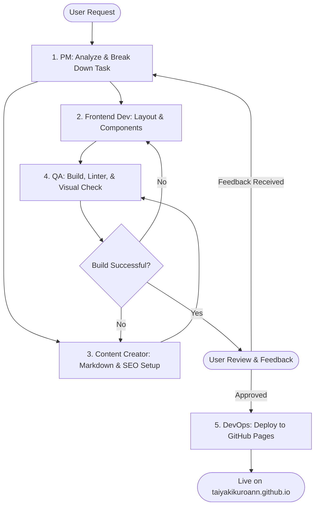

# AI Development Team for Astro Website

This project scope configuration defines the team of AI agents and the development flow for building, maintaining, and deploying the Astro-based website (specifically targeted for `taiyakikuroann.github.io`).

## Team Members & Roles

### 1. Product Manager (PM)
- **ID:** `pm`
- **Role:** Handles requirement analysis, task decomposition, and milestone planning. PM acts as the primary interface to the User, coordinates between development phases, and processes User feedback.
- **When To Use:** At the start of a feature request, during design phase alignment, or when consolidating User feedback to plan the next iteration of improvements.

### 2. Frontend Engineer
- **ID:** `frontend-dev`
- **Role:** Responsible for website architecture, building reusable Astro components, crafting premium Vanilla CSS layouts, and implementing responsive, accessible, and clean frontend code.
- **When To Use:** During component creation, layout adjustments, styling modifications, or implementing interactive features using Vanilla JavaScript.

### 3. Content Creator / Technical Writer
- **ID:** `content-creator`
- **Role:** Manages content structure (Astro Content Collections), creates Markdown/MDX files for technical memos and blogs, sets up metadata (SEO titles, descriptions), and ensures content readability.
- **When To Use:** Creating new technical memos, blog posts, modifying layouts of text-rich pages, or optimizing SEO metadata.

### 4. QA Engineer
- **ID:** `qa`
- **Role:** Validates the website's build stability, checks for broken links, ensures responsiveness across simulated screen sizes, runs visual quality checks, and runs tests/linters.
- **When To Use:** Once development is complete but before requesting User review, or before merging/deploying changes.

### 5. DevOps Engineer
- **ID:** `devops`
- **Role:** Manages GitHub Actions workflows, configures Astro for GitHub Pages (`github.io`) hosting, handles package upgrades, and ensures optimized asset delivery.
- **When To Use:** Configuring deployment pipelines, updating Astro configurations for deployment, or resolving build pipeline failures.

---

## Development Flow (Developer Handover & Task Flow)

To ensure high-quality delivery, the AI team follows a structured collaborative workflow, reacting to user inputs:

### Flow Step Details:

1. **Step 1: Requirements & Breakdown (PM)**
   - Analyze the user request (e.g. "I want a site that looks like X").
   - Define pages, component structure, and routing.
   - Outline the task list in a structured format (can use `/planning` or artifacts).
   - *Ensure the website is designed with future scalability in mind (blog update, communication board/forums).*

2. **Step 2: Component & Layout Implementation (Frontend Engineer)**
   - Initialize or update the Astro project structure.
   - Create clean, modular components inside `src/components` and layouts inside `src/layouts`.
   - Apply curated Vanilla CSS variables (colors, typography, spacing) inside `src/styles/global.css` ensuring premium aesthetics (gradients, smooth transitions, modern fonts).

3. **Step 3: Content Structuring (Content Creator)**
   - Define Astro Content Collections for "memos" or "blog".
   - Create Markdown templates with robust frontmatter metadata.
   - Write placeholder/initial technical memo articles.
   - Ensure semantic HTML, headings structure, and meta tags are integrated for SEO.

4. **Step 4: Quality Assurance (QA)**
   - Execute production build check: `npm run build`.
   - Audit responsiveness, layout shifts, console errors, and missing meta tags.
   - Present a clean verification status report to the user.

5. **Step 5: Feedback Iteration (PM & Team)**
   - Launch the local preview server (`npm run dev`) and guide the User to inspect the visual design.
   - Collect and parse User feedback, map it to individual members (`frontend-dev`, `content-creator`, etc.), and repeat steps 2-4.

6. **Step 6: GitHub Pages Deployment (DevOps)**
   - Configure Astro's `site` and `base` options for `taiyakikuroann.github.io`.
   - Set up automated GitHub Actions deployment.
   - Perform the final deploy and verify the URL is live.
